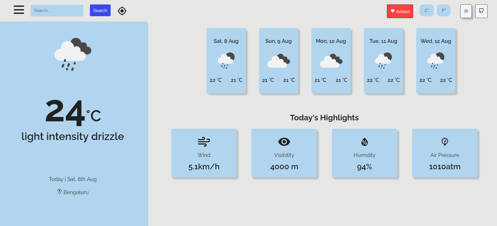

<h1 align="center">Reactive Weather</h1>

Auto formatted with Prettier

<h3 align="center">
  <a href="https://github.com/rajatkulkarni95/weather-app-react">Visit the live app</a> |
</h3>

 Libraries Used
  <ul>
    <li>react</li>
    <li>moment</li>
    <li>styled-components</li>
    <li>react-icons</li>
  </ul>

